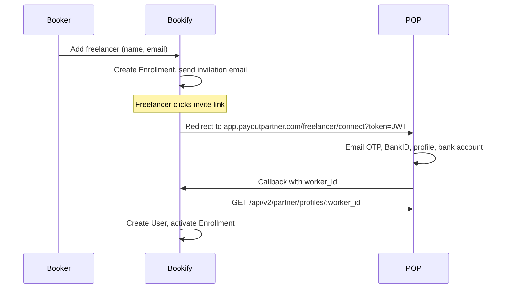
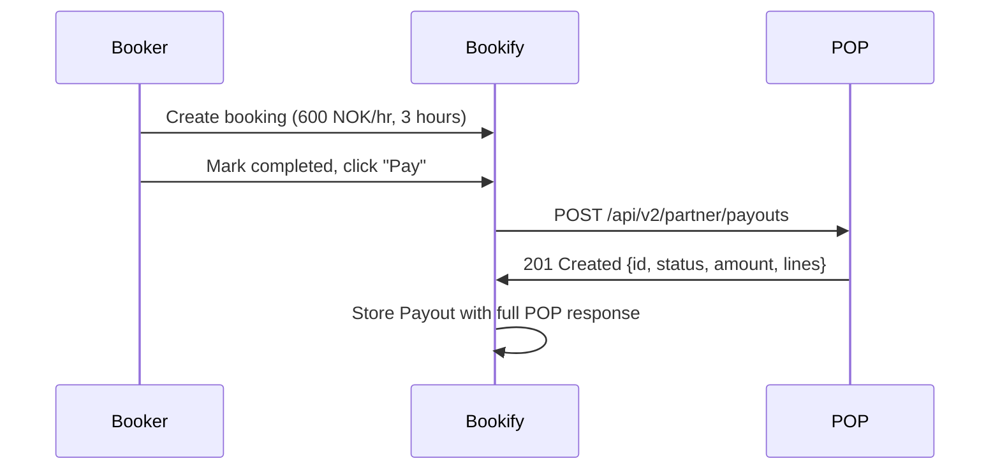
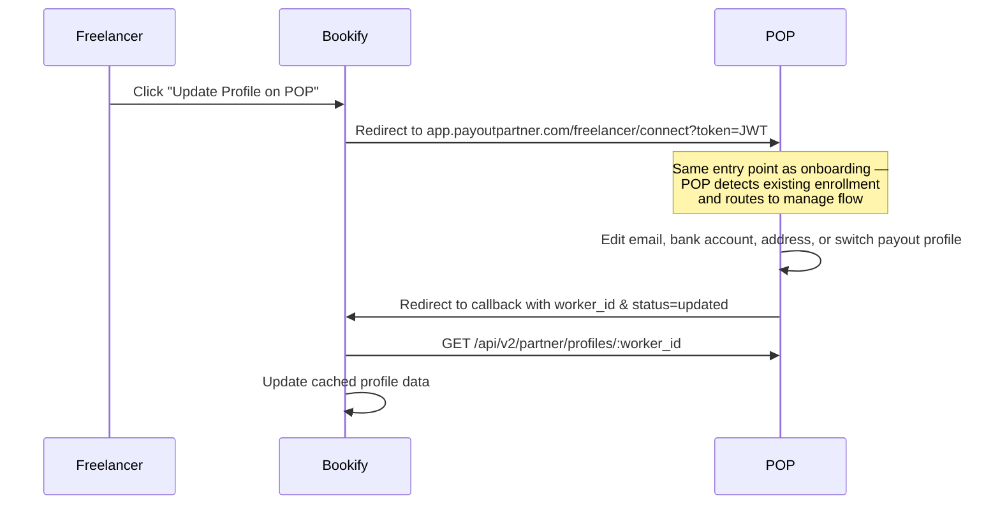
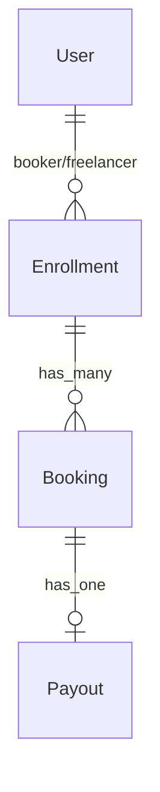

# Bookify

[](LICENSE)
[](https://www.ruby-lang.org/)
[](https://rubyonrails.org/)
[](https://heroku.com/deploy?template=https://github.com/payoutpartner/bookify-app)

Bookify is an open-source reference app built on the [Payout Partner](https://payoutpartner.com) (POP) API v2. It demonstrates how to onboard freelancers, create bookings, and process payouts using POP's REST API. Operators clone this codebase to study the integration patterns and build their own payout solution. A live demo runs at [bookify.app](https://bookify.app).

> **Screenshots will be added after the UI is deployed.**

---

## Try the Live Demo

1. Visit [bookify.app](https://bookify.app)
2. Sign up as a booker (enter your email, click the magic link)
3. Invite a freelancer
4. Walk through onboarding, creating a booking, and paying — all against POP's sandbox
5. Click the **API** button (bottom-right) on any page to see the exact HTTP calls made to POP

---

## POP Domain Architecture

Bookify interacts with two POP domains:

| Domain | Purpose |
|--------|---------|
| `core.payoutpartner.com` | **API endpoint** — all REST API calls (`/api/v2/partner/*`) |
| `app.payoutpartner.com` | **Freelancer portal** — onboarding and profile management |

Sandbox variants use the `sandbox.` prefix: `sandbox.core.payoutpartner.com` and `sandbox.app.payoutpartner.com`.

The partner portal for managing credentials is at `app.payoutpartner.com/partner`.

---

## The 3 Flows

### 1. Invite + Onboard



The `/freelancer/connect` endpoint on `app.payoutpartner.com` serves both onboarding (new freelancers) and profile management (returning freelancers). Bookify generates a signed JWT containing the `partner_worker_id` and `callback_url`, then redirects the freelancer to POP.

**JWT claims sent to POP:**
```json
{
  "partner_worker_id": "wk_abc123",
  "callback_url": "https://bookify.app/callbacks/onboard?token=INVITATION_TOKEN",
  "partner_id": "YOUR_PARTNER_UUID",
  "exp": 1743267600,
  "iat": 1743265800,
  "jti": "unique-token-id"
}
```

**POP redirects back with:**
```
https://bookify.app/callbacks/onboard?token=INVITATION_TOKEN&worker_id=wk_abc123&status=approved
```

If the freelancer switched from a previous worker ID during onboarding, POP also appends `&abandoned_worker_id=wk_old456`.

**After the callback, fetch the freelancer's profile:**
```bash
curl -X GET https://sandbox.core.payoutpartner.com/api/v2/partner/profiles/wk_abc123 \
  -H "Authorization: Bearer YOUR_API_KEY" \
  -H "Content-Type: application/json"
```

**Real response shape from the sandbox** (single enrollment, data anonymized):
```json
{
  "enrollment_id": "68a9c8bf-0642-403e-b657-c057b1a1edf0",
  "partner_worker_id": "wk_abc123",
  "payout_preference": "salary",
  "approved": true,
  "status": "Approved",
  "freelancer": {
    "address": { "line1": "Testgata 1", "postal_code": "0150", "city": "Oslo", "country": "NO" },
    "bank_account_number": "12345678903",
    "email": "anna@example.com",
    "first_name": "Anna",
    "freelance_type": "individual",
    "last_name": "Hansen",
    "organization_number": null,
    "personal_number": "25848296360"
  },
  "bank_account": "12345678903",
  "created_at": "2026-03-29T17:55:26.279Z",
  "updated_at": "2026-03-29T18:03:40.686Z"
}
```

> Note: the top-level ID field is `enrollment_id`, not `id`. If the freelancer has multiple payout profiles (e.g., individual + ENK), the response is an **array** of these objects. See [Profile Response](#profile-response) for field details.

### 2. Create Booking + Pay



**curl equivalent:**
```bash
curl -X POST https://sandbox.core.payoutpartner.com/api/v2/partner/payouts \
  -H "Authorization: Bearer YOUR_API_KEY" \
  -H "Content-Type: application/json" \
  -d '{
    "worker_id": "wk_abc123",
    "occupation_code": "7223.14",
    "invoiced_on": "2026-03-29",
    "due_on": "2026-04-12",
    "buyer_reference": "Bookify Demo",
    "order_reference": "BOOK-2026-001",
    "external_note": "March logo work",
    "lines": [{
      "description": "Logo design",
      "rate": 600,
      "quantity": 3,
      "work_started_at": "2026-03-29T09:00:00",
      "work_ended_at": "2026-03-29T12:00:00",
      "external_id": "booking-123"
    }]
  }'
```

**Real response shape from the sandbox** (data anonymized):
```json
{
  "id": "47c47210-ae90-4d1d-ab0f-968e686daf0e",
  "amount": 180000,
  "buyer_reference": "Bookify Demo",
  "created_at": "2026-03-29T21:19:38.946Z",
  "due_on": "2026-04-12",
  "external_note": null,
  "freelancer": { "email": "anna@example.com", "name": "Anna Hansen", "enrolled": true },
  "idempotency_key": "booking-a1d456d4-3d71-476b-8ca5-70518044b0ab",
  "invoice_number": null,
  "invoiced_on": "2026-03-29",
  "lines": [{
    "id": "674c0357-d984-48e1-966d-1b45fc174fb3",
    "amount": 180000,
    "description": "Logo design",
    "external_id": null,
    "line_type": "work",
    "occupation_code": "7223.14",
    "quantity": "3.0",
    "unit_price": 60000,
    "vat": 45000,
    "vat_rate": "0.25",
    "work_ended_at": "2026-03-29T12:00:00.000Z",
    "work_started_at": "2026-03-29T09:00:00.000Z"
  }],
  "order_reference": null,
  "status": "submitted",
  "updated_at": "2026-03-29T21:49:11.107Z",
  "vat": 45000
}
```

> **Key things to note:**
> - `invoice_number` is `null` while the payout is in `submitted` status — it only appears once the invoice is `published`
> - `rate` in the request is in **NOK**, but `amount` and `unit_price` in the response are in **øre** (1/100 NOK)
> - `quantity` and `vat_rate` are returned as strings, not numbers
> - `buyer_reference` defaults to the partner account name if not provided in the request
> - Use the **API** button in Bookify to inspect responses live. See [Payout Request Fields](#payout-request-fields) below for the full field reference.

### 3. Profile Management (Manage Flow)



The manage flow reuses the same `/freelancer/connect` entry point and JWT as onboarding. POP detects that the freelancer already has an approved enrollment and routes them to the profile management UI instead of the onboarding wizard.

**POP redirects back with:**
```
https://bookify.app/callbacks/manage?worker_id=wk_abc123&status=updated
```

---

## Sandbox Testing Guide

Bookify connects to POP's sandbox at `sandbox.core.payoutpartner.com`. During onboarding, freelancers verify their identity using test credentials. No real money is involved — sandbox payouts are simulated.

Contact [Payout Partner](https://payoutpartner.com) to get your sandbox API key.

### OTP Verification

The sandbox OTP code is always **`111111`**. Enter this when prompted for the email verification code during onboarding or profile management.

### Test BankID

Generate test personal numbers (fødselsnummer) for BankID verification:

- **BankID Preprod RA tool:** [ra-preprod.bankidnorge.no](https://ra-preprod.bankidnorge.no/#!/search/endUser) — create and manage test BankID users
- **Criipto test users:** [docs.criipto.com/verify/guides/test-users](https://docs.criipto.com/verify/guides/test-users/)

### Test Folkeregister Identities

For the manual identity verification path (Folkeregister lookup), use synthetic test identities from Norway's test population registry. Here are some examples:

| Name | Personal Number |
|------|----------------|
| ULTRAFIOLETT BIKKJE | 25848296360 |
| VIS LØVETANN TALLERKEN | 26899397516 |
| ØKOLOGISK SALVE | 16857499399 |
| SØVNIG BIBLIOTEKAR | 26828999574 |
| IMPULSIV BURSDAG | 29863049952 |

Find more test identities at [testdata.skatteetaten.no](https://testdata.skatteetaten.no/web/testnorge/soek/freg) — search the Folkeregister test database for synthetic persons with valid addresses.

### Test Organization Numbers

For ENK/AS (organization) payout profiles, you need a valid Norwegian organization number. Look up real test organizations at [brreg.no](https://www.brreg.no) (Brønnøysundregistrene). In the sandbox environment, org numbers in the `9xxxxxxxx` range are commonly used for testing.

---

## Deploy Your Own

### One-Click Heroku Deploy

[](https://heroku.com/deploy?template=https://github.com/payoutpartner/bookify-app)

You'll need:
- A POP sandbox API key (`POP_API_KEY`)
- A POP HMAC secret (`POP_HMAC_SECRET`)
- A POP Partner ID (`POP_PARTNER_ID`)

Optional (for emails):
- Amazon SES SMTP credentials

### Manual Deploy

```bash
git clone https://github.com/payoutpartner/bookify-app.git
cd bookify-app
heroku create my-bookify
heroku addons:create heroku-postgresql:essential-0
heroku config:set POP_API_KEY=your-key POP_HMAC_SECRET=your-secret POP_PARTNER_ID=your-id
heroku config:set SECRET_KEY_BASE=$(rails secret)
git push heroku main
```

---

## Run Locally

### With Docker (recommended)

Prerequisites: Docker with Compose

```bash
git clone https://github.com/payoutpartner/bookify-app.git
cd bookify-app
docker compose up
# Visit http://localhost:3000
```

Seed the database on first run:

```bash
docker compose exec app bundle exec rails db:seed
```

To open a Rails console:

```bash
docker compose exec app bundle exec rails c
```

POP credentials are optional — each booker can enter their own in Settings. To set a global fallback, copy `.env.sample` to `.env` and fill in the values before `docker compose up`.

### Without Docker

Prerequisites: Ruby 3.2.0, PostgreSQL

```bash
git clone https://github.com/payoutpartner/bookify-app.git
cd bookify-app
bundle install
cp .env.sample .env
# Edit .env with your POP sandbox credentials

rails db:create db:migrate db:seed
rails s
# Visit http://localhost:3000
```

Emails open in the browser via `letter_opener` — no SES needed locally.

---

## Architecture

### Data Model



- **User** — booker or freelancer (enum). Bookers sign up; freelancers are created from POP callbacks.
- **Enrollment** — the booker↔freelancer relationship. Tracks invitation status and POP worker ID. Maps to POP's enrollment concept.
- **Booking** — a unit of work with rate (in øre) and hours.
- **Payout** — payment processed through POP. Stores the full POP API response.

### Key Files

| File | Purpose |
|------|---------|
| `app/services/pop_api_client.rb` | Wraps all POP API v2 endpoints |
| `app/controllers/callbacks_controller.rb` | Receives POP onboard/manage redirects |
| `app/controllers/booker/` | Booker dashboard, freelancers, bookings, payouts |
| `app/controllers/freelancer/` | Freelancer dashboard + profile |
| `app/views/shared/_developer_notes.html.haml` | Slide-out API call panel |

### Data Isolation

Each booker only sees their own data. Queries scope through `current_user`:
- Booker A cannot see Booker B's freelancers, bookings, or payouts
- Freelancers see their enrollments across all bookers

### Money in Øre

All monetary values are stored as integers in øre (1/100 NOK). `rate_ore = 60000` means 600.00 NOK/hr. POP's API accepts `rate` in whole NOK, so `PopApiClient` converts: `rate_ore / 100`.

---

## POP API Reference

| Endpoint | Method | Description |
|----------|--------|-------------|
| `/api/v2/partner/enrollments` | GET | List enrolled freelancers |
| `/api/v2/partner/enrollments/:id` | GET | Get single enrollment |
| `/api/v2/partner/enrollments/:id` | DELETE | Delete enrollment |
| `/api/v2/partner/enrollments/:id/deactivate` | POST | Deactivate enrollment |
| `/api/v2/partner/enrollments/:id/reactivate` | POST | Reactivate enrollment |
| `/api/v2/partner/profiles/:worker_id` | GET | Get freelancer profile(s) |
| `/api/v2/partner/occupation_codes` | GET | List valid occupation codes |
| `/api/v2/partner/payouts` | POST | Create a payout |
| `/api/v2/partner/payouts` | GET | List payouts (paginated) |
| `/api/v2/partner/payouts/:id` | GET | Get payout status |
| `/api/v2/partner/bundles` | POST | Create a bundle (batch approval) |

Full API documentation: [POP API Docs](https://sandbox.core.payoutpartner.com/api-docs)

### Payout Request Fields

When creating a payout via `POST /api/v2/partner/payouts`, you can send the following fields. Bookify sends a minimal subset — your integration can send much more.

**Invoice-level fields:**

| Field | Required | Description |
|-------|----------|-------------|
| `worker_id` | Yes | The `partner_worker_id` identifying the freelancer |
| `lines` | Yes | Array of line items (see below) |
| `occupation_code` | No | Default occupation code for all lines; falls back to partner default on POP |
| `invoiced_on` | No | Invoice date (ISO 8601). Defaults to today |
| `due_on` | No | Payment due date (ISO 8601). Defaults to `invoiced_on` + 14 days |
| `buyer_reference` | No | Client/buyer reference. Defaults to partner account name |
| `order_reference` | No | PO number or partner reference. Used for idempotency if no `idempotency_key` |
| `external_note` | No | Memo or note attached to the invoice |
| `idempotency_key` | No | UUID for idempotent requests. Auto-generated from invoice contents if omitted |

**Line-level fields (each item in `lines`):**

| Field | Required | Description |
|-------|----------|-------------|
| `description` | Yes | Work description (e.g., "Logo design", "Consulting March 2026") |
| `rate` | Yes* | Hourly/unit rate in **NOK** (not øre). POP converts to øre internally |
| `unit_price` | Yes* | Alternative to `rate` — price in **øre** (1 NOK = 100 øre) |
| `quantity` | No | Hours or units worked. Defaults to 1 |
| `occupation_code` | No | Line-specific code; overrides the invoice-level code |
| `work_started_at` | No | ISO 8601 timestamp. Defaults to `invoiced_on` at 08:00 |
| `work_ended_at` | No | ISO 8601 timestamp. Defaults to `work_started_at` + `work_hours` |
| `work_hours` | No | Hours worked. Used to calculate `work_ended_at` if not provided. Defaults to 1 |
| `external_id` | No | Partner's own line item reference/ID |

*Either `rate` or `unit_price` is required per line.

**Comprehensive example:**

```bash
curl -X POST https://sandbox.core.payoutpartner.com/api/v2/partner/payouts \
  -H "Authorization: Bearer YOUR_API_KEY" \
  -H "Content-Type: application/json" \
  -d '{
    "worker_id": "freelancer-42",
    "occupation_code": "7223.14",
    "invoiced_on": "2026-03-29",
    "due_on": "2026-04-12",
    "buyer_reference": "Acme Corp",
    "order_reference": "PO-2026-0042",
    "external_note": "March consulting work",
    "lines": [
      {
        "description": "Frontend development",
        "rate": 800,
        "quantity": 40,
        "work_started_at": "2026-03-01T09:00:00",
        "work_ended_at": "2026-03-29T17:00:00",
        "external_id": "task-frontend-march"
      },
      {
        "description": "Code review",
        "rate": 600,
        "quantity": 8,
        "occupation_code": "2512.01",
        "work_started_at": "2026-03-15T09:00:00",
        "work_hours": 8,
        "external_id": "task-review-march"
      }
    ]
  }'
```

**Payout response fields:**

| Field | Description |
|-------|-------------|
| `id` | POP's payout/invoice UUID |
| `status` | Invoice status: `submitted`, `published`, `paid`, etc. |
| `invoice_number` | Invoice number (integer). **`null` while `submitted`** — only set once `published` |
| `amount` | Total amount in øre (integer) |
| `vat` | Total VAT in øre (integer) |
| `invoiced_on` | Invoice date (ISO 8601 date) |
| `due_on` | Due date (ISO 8601 date) |
| `buyer_reference` | Client reference (defaults to partner account name) |
| `order_reference` | Partner reference |
| `external_note` | Note/memo |
| `idempotency_key` | Idempotency key used |
| `created_at` | ISO 8601 timestamp |
| `updated_at` | ISO 8601 timestamp |
| `freelancer` | Nested: `{ email, name, enrolled }` |
| `lines[].id` | Line item UUID |
| `lines[].description` | Work description |
| `lines[].unit_price` | Price per unit in øre (integer) |
| `lines[].quantity` | Quantity (string, e.g., `"3.0"`) |
| `lines[].amount` | Line total in øre (integer) |
| `lines[].vat` | Line VAT in øre (integer) |
| `lines[].vat_rate` | VAT rate (string, e.g., `"0.25"`) |
| `lines[].line_type` | Always `"work"` for payouts |
| `lines[].occupation_code` | Occupation code for this line |
| `lines[].work_started_at` | ISO 8601 timestamp |
| `lines[].work_ended_at` | ISO 8601 timestamp |
| `lines[].external_id` | Partner's line item reference |

### Profile Response

`GET /api/v2/partner/profiles/:worker_id` returns enrollment and freelancer data. Note: if the freelancer has multiple payout profiles (e.g., individual salary + ENK organization), the response is an **array** of profile objects.

| Field | Description |
|-------|-------------|
| `enrollment_id` | Enrollment UUID on POP (note: **not** `id`) |
| `partner_worker_id` | The worker ID you assigned |
| `payout_preference` | `salary` or `enk` |
| `approved` | Whether the enrollment is approved |
| `status` | Enrollment status (e.g., `"Approved"`) |
| `freelancer.email` | Freelancer's email |
| `freelancer.first_name` | First name |
| `freelancer.last_name` | Last name |
| `freelancer.freelance_type` | `individual` or `organization` |
| `freelancer.personal_number` | Norwegian personal number (fødselsnummer) |
| `freelancer.organization_number` | Norwegian org number (null for individuals) |
| `freelancer.address` | Nested object: `line1`, `postal_code`, `city`, `country` |
| `freelancer.bank_account_number` | Bank account number (nested in freelancer) |
| `bank_account` | Bank account number (top-level duplicate) |
| `created_at` | ISO 8601 timestamp |
| `updated_at` | ISO 8601 timestamp |

---

## Tests

```bash
bundle exec rspec                    # all specs
bundle exec rspec spec/services/     # PopApiClient specs
bundle exec rspec spec/requests/     # request specs
```

Tests use WebMock to stub POP API calls — no real network in tests.

---

## License

[MIT](LICENSE) — Payout Partner (Skiwo AS)
