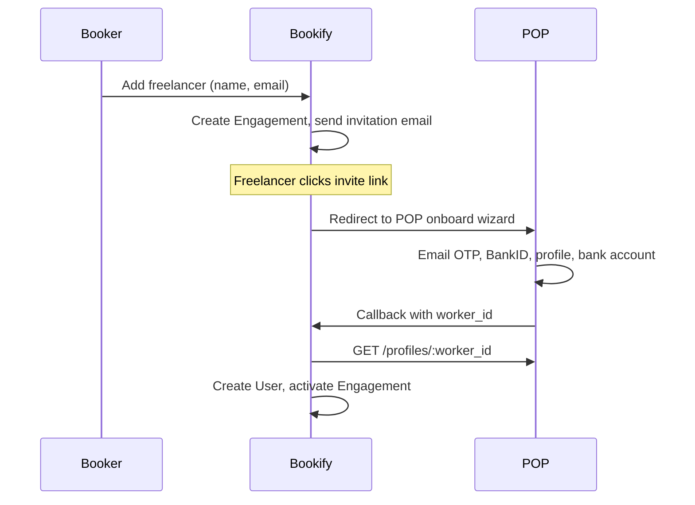
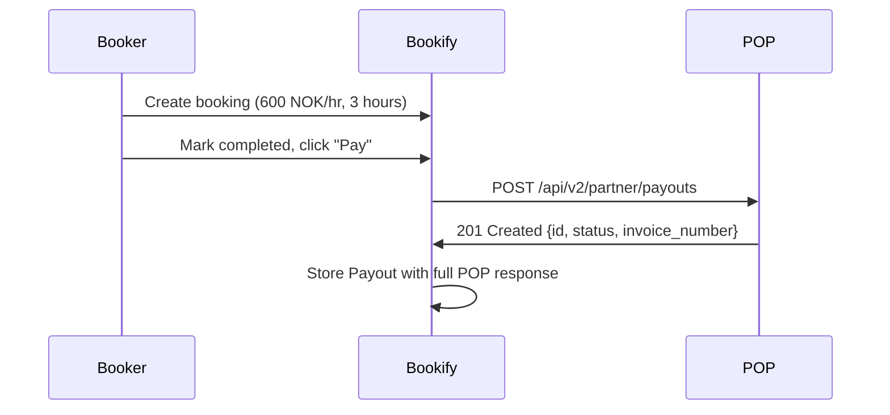
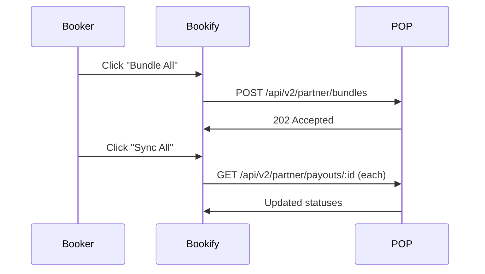
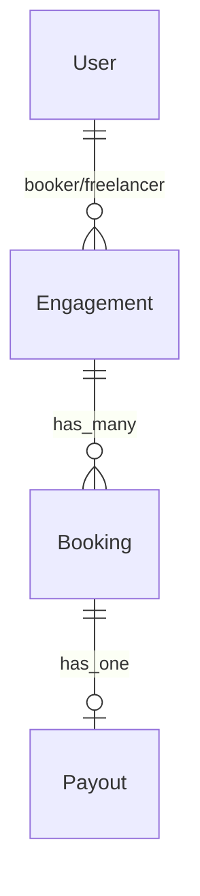

# Bookify

[](LICENSE)
[](https://www.ruby-lang.org/)
[](https://rubyonrails.org/)
[](https://heroku.com/deploy?template=https://github.com/payoutpartner/bookify-app)

Bookify is an open-source, two-sided freelancer payment marketplace built on the [Payout Partner](https://payoutpartner.com) API v2. It demonstrates how to onboard freelancers, create bookings, process payouts, and bundle invoices using POP's REST API. Operators clone this codebase to study the integration patterns and build their own marketplace. A live demo runs at [bookify.app](https://bookify.app).

> **Screenshots will be added after the UI is deployed.**

---

## Try the Live Demo

1. Visit [bookify.app](https://bookify.app)
2. Sign up as a booker (enter your email, click the magic link)
3. Invite a freelancer
4. Walk through onboarding, creating a booking, and paying — all against POP's sandbox
5. Click the **API** button (bottom-right) on any page to see the exact HTTP calls made to POP

---

## The 3 Flows

### 1. Invite + Onboard



**curl equivalent:**
```bash
# After onboarding, fetch the freelancer's profile from POP:
curl -X GET https://sandbox.core.payoutpartner.com/api/v2/partner/profiles/wk_abc123 \
  -H "Authorization: Bearer YOUR_API_KEY" \
  -H "Content-Type: application/json"
```

### 2. Create Booking + Pay



**curl equivalent:**
```bash
curl -X POST https://sandbox.core.payoutpartner.com/api/v2/partner/payouts \
  -H "Authorization: Bearer YOUR_API_KEY" \
  -H "Content-Type: application/json" \
  -d '{
    "worker_id": "wk_abc123",
    "occupation_code": "7223.14",
    "invoiced_on": "2026-03-29",
    "lines": [{
      "description": "Logo design",
      "rate": 600,
      "quantity": 3
    }]
  }'
```

### 3. Bundle + Sync Status



**curl equivalent:**
```bash
# Bundle:
curl -X POST https://sandbox.core.payoutpartner.com/api/v2/partner/bundles \
  -H "Authorization: Bearer YOUR_API_KEY"

# Check payout status:
curl -X GET https://sandbox.core.payoutpartner.com/api/v2/partner/payouts/PAY_ID \
  -H "Authorization: Bearer YOUR_API_KEY"
```

---

## Sandbox & Test BankID

Bookify connects to POP's sandbox at `sandbox.core.payoutpartner.com`. During onboarding, freelancers verify their identity using test credentials:

- **Create test personal numbers:** Use the [BankID Preprod RA tool](https://ra-preprod.bankidnorge.no/#!/search/endUser) to generate valid Norwegian test personal numbers (fødselsnummer) for sandbox testing
- **Test BankID:** Provided by [Criipto](https://docs.criipto.com/verify/guides/test-users/) / [Idura](https://idura.eu)
- **Test OTPs:** The sandbox accepts any 6-digit code
- **No real money:** Sandbox payouts are simulated

Contact [Payout Partner](https://payoutpartner.com) to get your sandbox API key.

---

## Deploy Your Own

### One-Click Heroku Deploy

[](https://heroku.com/deploy?template=https://github.com/payoutpartner/bookify-app)

You'll need:
- A POP sandbox API key (`POP_API_KEY`)
- A POP HMAC secret (`POP_HMAC_SECRET`)
- A POP Partner ID (`POP_PARTNER_ID`)

Optional (for emails):
- Amazon SES SMTP credentials

### Manual Deploy

```bash
git clone https://github.com/payoutpartner/bookify-app.git
cd bookify-app
heroku create my-bookify
heroku addons:create heroku-postgresql:essential-0
heroku config:set POP_API_KEY=your-key POP_HMAC_SECRET=your-secret POP_PARTNER_ID=your-id
heroku config:set SECRET_KEY_BASE=$(rails secret)
git push heroku main
```

---

## Run Locally

```bash
# Prerequisites: Ruby 3.2.0, PostgreSQL

git clone https://github.com/payoutpartner/bookify-app.git
cd bookify-app
bundle install
cp .env.sample .env
# Edit .env with your POP sandbox credentials

rails db:create db:migrate db:seed
rails s
# Visit http://localhost:3000
```

Emails open in the browser via `letter_opener` — no SES needed locally.

---

## Architecture

### Data Model



- **User** — booker or freelancer (enum). Bookers sign up; freelancers are created from POP callbacks.
- **Engagement** — the booker↔freelancer relationship. Tracks invitation status and POP worker ID.
- **Booking** — a unit of work with rate (in øre) and hours.
- **Payout** — payment processed through POP. Stores the full POP API response.

### Key Files

| File | Purpose |
|------|---------|
| `app/services/pop_api_client.rb` | Wraps all POP API v2 endpoints |
| `app/controllers/callbacks_controller.rb` | Receives POP onboard/manage redirects |
| `app/controllers/booker/` | Booker dashboard, freelancers, bookings, payouts |
| `app/controllers/freelancer/` | Freelancer dashboard + profile |
| `app/views/shared/_developer_notes.html.haml` | Slide-out API call panel |

### Data Isolation

Each booker only sees their own data. Queries scope through `current_user`:
- Booker A cannot see Booker B's freelancers, bookings, or payouts
- Freelancers see their engagements across all bookers

### Money in Øre

All monetary values are stored as integers in øre (1/100 NOK). `rate_ore = 60000` means 600.00 NOK/hr. POP's API accepts `rate` in whole NOK, so `PopApiClient` converts: `rate_ore / 100`.

---

## POP API Reference

| Endpoint | Method | Description |
|----------|--------|-------------|
| `/api/v2/partner/enrollments` | GET | List enrolled freelancers |
| `/api/v2/partner/profiles/:worker_id` | GET | Get freelancer profile |
| `/api/v2/partner/occupation_codes` | GET | List valid occupation codes |
| `/api/v2/partner/payouts` | POST | Create a payout |
| `/api/v2/partner/payouts/:id` | GET | Get payout status |
| `/api/v2/partner/bundles` | POST | Bundle organization invoices |

Full API documentation: [POP Swagger Docs](https://sandbox.core.payoutpartner.com/api-docs)

---

## Tests

```bash
bundle exec rspec                    # all specs
bundle exec rspec spec/services/     # PopApiClient specs
bundle exec rspec spec/requests/     # request specs
```

Tests use WebMock to stub POP API calls — no real network in tests.

---

## License

[MIT](LICENSE) — Payout Partner (Skiwo AS)
