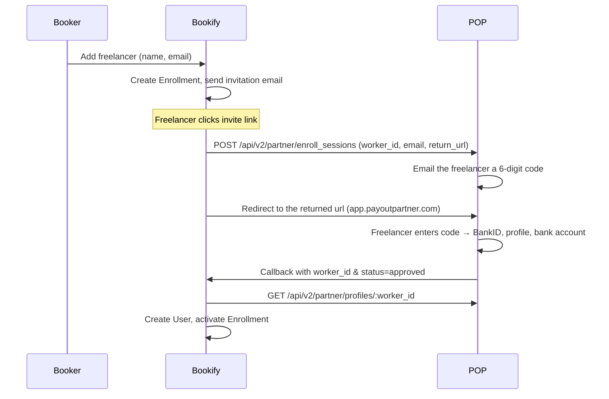
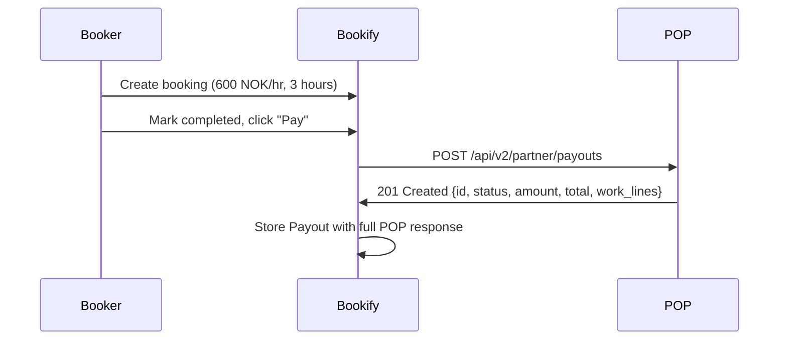
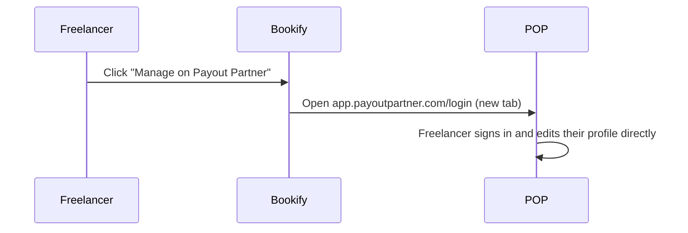
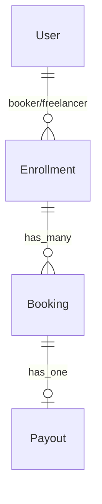

# Bookify

[](LICENSE)
[](https://www.ruby-lang.org/)
[](https://rubyonrails.org/)
[](https://heroku.com/deploy?template=https://github.com/payoutpartner/bookify-app)

Bookify is an open-source reference app built on the [Payout Partner](https://payoutpartner.com) (POP) API v2. It demonstrates how to onboard freelancers, create bookings, and process payouts using POP's REST API. Operators clone this codebase to study the integration patterns and build their own payout solution. A live demo runs at [bookify.app](https://bookify.app).

> **Screenshots will be added after the UI is deployed.**

---

## Try the Live Demo

1. Visit [bookify.app](https://bookify.app)
2. Sign up as a booker (enter your email, click the magic link)
3. Invite a freelancer
4. Walk through onboarding, creating a booking, and paying — all against POP's sandbox
5. Click the **API** button (bottom-right) on any page to see the exact HTTP calls made to POP

---

## POP Domain Architecture

Bookify interacts with two POP domains:

| Domain | Purpose |
|--------|---------|
| `api.payoutpartner.com` | **API endpoint** — all REST API calls (`/api/v2/partner/*`) |
| `app.payoutpartner.com` | **Freelancer portal** — onboarding and profile management |

Sandbox variants use the `sandbox.` prefix: `sandbox.api.payoutpartner.com` and `sandbox.app.payoutpartner.com`.

The partner portal for managing credentials is at `app.payoutpartner.com/partner`.

---

## The 3 Flows

### 1. Invite + Onboard


```mermaid
sequenceDiagram
    participant Booker
    participant Bookify
    participant POP

    Booker->>Bookify: Add freelancer (name, email)
    Bookify->>Bookify: Create Enrollment, send invitation email
    Note over Bookify: Freelancer clicks invite link
    Bookify->>POP: POST /api/v2/partner/enroll_sessions (worker_id, email, return_url)
    POP->>POP: Email the freelancer a 6-digit code
    Bookify->>POP: Redirect to the returned url (app.payoutpartner.com)
    POP->>POP: Freelancer enters code → BankID, profile, bank account
    POP->>Bookify: Callback with worker_id & status=approved
    Bookify->>POP: GET /api/v2/partner/profiles/:worker_id
    Bookify->>Bookify: Create User, activate Enrollment
```

Bookify calls `POST /api/v2/partner/enroll_sessions` with the freelancer's `worker_id` (any stable id you choose), `email`, and a `return_url`. POP emails the freelancer a **6-digit code** (not a clickable link) and returns a non-secret co-branded `url`; Bookify redirects the freelancer there to enter the code. POP then collects identity (BankID) + bank details on its own hosted page — Bookify never handles them, and needs no JWT or HMAC secret.

**Request body sent to POP:**
```json
{
  "worker_id": "wk_abc123",
  "email": "freelancer@example.com",
  "return_url": "https://bookify.app/callbacks/onboard?token=INVITATION_TOKEN"
}
```

**Response:**
```json
{
  "id": "es_…",
  "url": "https://app.payoutpartner.com/enroll?partner=<slug>&worker=wk_abc123",
  "expires_at": "2026-04-20T15:30:00Z"
}
```

**POP redirects back with:**
```
https://bookify.app/callbacks/onboard?token=INVITATION_TOKEN&worker_id=wk_abc123&status=approved
```

`status` is `approved | cancelled | expired`.

**After the callback, fetch the freelancer's profile:**
```bash
curl -X GET https://sandbox.api.payoutpartner.com/api/v2/partner/profiles/wk_abc123 \
  -H "Authorization: Bearer YOUR_API_KEY" \
  -H "Content-Type: application/json"
```

**Response shape** (masked per B-022 — you never receive a full bank account or
personal number; POP holds those):
```json
{
  "worker_id": "wk_abc123",
  "status": "approved",
  "payout_preference": "salary",
  "freelancer": {
    "name": "Anna Hansen",
    "email": "anna@example.com",
    "freelance_type": "individual",
    "organization_number": null,
    "personal_number": "250482*****",
    "address": { "line1": "Testgata 1", "postal_code": "0150", "city": "Oslo", "country": "NO" }
  },
  "payout_method": {
    "bank_account_number": "****8903",
    "currency": "NOK",
    "tax_rate": "22%",
    "tax_card_valid": true,
    "frikort_amount": 0
  },
  "created_at": "2026-03-29T17:55:26.279Z",
  "updated_at": "2026-03-29T18:03:40.686Z"
}
```

> The join key is `worker_id` (the id you assigned). Bank account and personal
> number are masked; `payout_method` is read-only metadata. See
> [Profile Response](#profile-response) for field details.

### 2. Create Booking + Pay


```mermaid
sequenceDiagram
    participant Booker
    participant Bookify
    participant POP

    Booker->>Bookify: Create booking (600 NOK/hr, 3 hours)
    Booker->>Bookify: Mark completed, click "Pay"
    Bookify->>POP: POST /api/v2/partner/payouts
    POP->>Bookify: 201 Created {id, status, amount, total, work_lines}
    Bookify->>Bookify: Store Payout with full POP response
```

**curl equivalent** (money is integer **øre** — 60000 = 600.00 NOK; `idempotency_key`
is mandatory):
```bash
curl -X POST https://sandbox.api.payoutpartner.com/api/v2/partner/payouts \
  -H "Authorization: Bearer YOUR_API_KEY" \
  -H "Content-Type: application/json" \
  -d '{
    "worker_id": "wk_abc123",
    "idempotency_key": "booking-123",
    "due_on": "2026-04-12",
    "buyer_reference": "Bookify Demo",
    "order_reference": "BOOK-2026-001",
    "external_note": "March logo work",
    "work_lines": [{
      "occupation_code": "7223.14",
      "unit_price": 60000,
      "quantity": 3,
      "duration": { "start_date": "2026-03-29", "end_date": "2026-03-29", "duration_hours": 3 }
    }]
  }'
```

**Response shape:**
```json
{
  "id": "47c47210-ae90-4d1d-ab0f-968e686daf0e",
  "status": "submitted",
  "worker_id": "wk_abc123",
  "idempotency_key": "booking-123",
  "invoice_number": null,
  "amount": 180000,
  "vat": 45000,
  "total": 225000,
  "currency": "NOK",
  "invoiced_on": "2026-03-29",
  "due_on": "2026-04-12",
  "order_reference": "BOOK-2026-001",
  "buyer_reference": "Bookify Demo",
  "paid_out_at": null,
  "created_at": "2026-03-29T21:19:38.946Z",
  "updated_at": "2026-03-29T21:49:11.107Z",
  "work_lines": [{
    "occupation_code": "7223.14",
    "unit_price": 60000,
    "quantity": "3.0",
    "vat_rate": "0.25"
  }]
}
```
`paid_out_at` is the paid signal — null until POP processes the salary run. No
freelancer salary breakdown is exposed.

> **Key things to note:**
> - `invoice_number` is `null` while the payout is in `submitted` status — it only appears once the invoice is `published`
> - `rate` in the request is in **NOK**, but `amount` and `unit_price` in the response are in **øre** (1/100 NOK)
> - `quantity` and `vat_rate` are returned as strings, not numbers
> - `buyer_reference` defaults to the partner account name if not provided in the request
> - Use the **API** button in Bookify to inspect responses live. See [Payout Request Fields](#payout-request-fields) below for the full field reference.

### 3. Profile Management (Manage Flow)


```mermaid
sequenceDiagram
    participant Freelancer
    participant Bookify
    participant POP

    Freelancer->>Bookify: Click "Manage on Payout Partner"
    Bookify->>POP: Open app.payoutpartner.com/login (new tab)
    POP->>POP: Freelancer signs in and edits their profile directly
```

The code-based flow has no partner-initiated "manage" round-trip: POP does not call back for an already-onboarded freelancer (they skip the onboarding wizard). So the manage affordance simply links the freelancer to POP's login, where they sign in and edit their profile, bank account, or address directly. Bookify re-syncs the cached profile via `GET /api/v2/partner/profiles/:worker_id` on its own schedule.

---

## Sandbox Testing Guide

Bookify connects to POP's sandbox at `sandbox.api.payoutpartner.com`. During onboarding, freelancers verify their identity using test credentials. No real money is involved — sandbox payouts are simulated.

Contact [Payout Partner](https://payoutpartner.com) to get your sandbox API key.

### OTP Verification

The sandbox OTP code is always **`111111`**. Enter this when prompted for the email verification code during onboarding or profile management.

### Test BankID

Generate test personal numbers (fødselsnummer) for BankID verification:

- **BankID Preprod RA tool:** [ra-preprod.bankidnorge.no](https://ra-preprod.bankidnorge.no/#!/search/endUser) — create and manage test BankID users
- **Criipto test users:** [docs.criipto.com/verify/guides/test-users](https://docs.criipto.com/verify/guides/test-users/)

### Test Folkeregister Identities

For the manual identity verification path (Folkeregister lookup), use synthetic test identities from Norway's test population registry. Here are some examples:

| Name | Personal Number |
|------|----------------|
| ULTRAFIOLETT BIKKJE | 25848296360 |
| VIS LØVETANN TALLERKEN | 26899397516 |
| ØKOLOGISK SALVE | 16857499399 |
| SØVNIG BIBLIOTEKAR | 26828999574 |
| IMPULSIV BURSDAG | 29863049952 |

Find more test identities at [testdata.skatteetaten.no](https://testdata.skatteetaten.no/web/testnorge/soek/freg) — search the Folkeregister test database for synthetic persons with valid addresses.

### Test Organization Numbers

For ENK/AS (organization) payout profiles, you need a valid Norwegian organization number. Look up real test organizations at [brreg.no](https://www.brreg.no) (Brønnøysundregistrene). In the sandbox environment, org numbers in the `9xxxxxxxx` range are commonly used for testing.

---

## Deploy Your Own

### One-Click Heroku Deploy

[](https://heroku.com/deploy?template=https://github.com/payoutpartner/bookify-app)

You'll need:
- A POP sandbox API key (`POP_API_KEY`, `pk_sandbox_…`) — the only credential the integration requires
- Optionally `POP_BASE_URL` / `POP_APP_URL` to override the default sandbox hosts

Optional (for emails):
- Amazon SES SMTP credentials

### Manual Deploy

```bash
git clone https://github.com/payoutpartner/bookify-app.git
cd bookify-app
heroku create my-bookify
heroku addons:create heroku-postgresql:essential-0
heroku config:set POP_API_KEY=pk_sandbox_your_key
heroku config:set SECRET_KEY_BASE=$(rails secret)
git push heroku main
```

---

## Run Locally

### With Docker (recommended)

Prerequisites: Docker with Compose

```bash
git clone https://github.com/payoutpartner/bookify-app.git
cd bookify-app
docker compose up
# Visit http://localhost:3000
```

Seed the database on first run:

```bash
docker compose exec app bundle exec rails db:seed
```

To open a Rails console:

```bash
docker compose exec app bundle exec rails c
```

POP credentials are optional — each booker can enter their own in Settings. To set a global fallback, copy `.env.sample` to `.env` and fill in the values before `docker compose up`.

### Without Docker

Prerequisites: Ruby 3.2.0, PostgreSQL

```bash
git clone https://github.com/payoutpartner/bookify-app.git
cd bookify-app
bundle install
cp .env.sample .env
# Edit .env with your POP sandbox credentials

rails db:create db:migrate db:seed
rails s
# Visit http://localhost:3000
```

Emails open in the browser via `letter_opener` — no SES needed locally.

---

## Architecture

### Data Model


```mermaid
erDiagram
    User ||--o{ Enrollment : "booker/freelancer"
    Enrollment ||--o{ Booking : has_many
    Booking ||--o| Payout : has_one
```

- **User** — booker or freelancer (enum). Bookers sign up; freelancers are created from POP callbacks.
- **Enrollment** — the booker↔freelancer relationship. Tracks invitation status and POP worker ID. Maps to POP's enrollment concept.
- **Booking** — a unit of work with rate (in øre) and hours.
- **Payout** — payment processed through POP. Stores the full POP API response.

### Key Files

| File | Purpose |
|------|---------|
| `app/services/pop_api_client.rb` | Wraps all POP API v2 endpoints |
| `app/controllers/callbacks_controller.rb` | Receives POP onboard/manage redirects |
| `app/controllers/booker/` | Booker dashboard, freelancers, bookings, payouts |
| `app/controllers/freelancer/` | Freelancer dashboard + profile |
| `app/views/shared/_developer_notes.html.haml` | Slide-out API call panel |

### Data Isolation

Each booker only sees their own data. Queries scope through `current_user`:
- Booker A cannot see Booker B's freelancers, bookings, or payouts
- Freelancers see their enrollments across all bookers

### Money in Øre

All monetary values are integers in øre (1/100 NOK). `rate_ore = 60000` means
600.00 NOK. API v2 takes amounts as `unit_price` in **øre directly** — there is no
NOK conversion, so `PopApiClient` sends `rate_ore` verbatim. Never use floats.

---

## POP API Reference

| Endpoint | Method | Description |
|----------|--------|-------------|
| `/api/v2/partner/enroll_sessions` | POST | Start an OTP-gated onboarding session |
| `/api/v2/partner/payout_method_sessions` | POST | Start an OTP session to change payout preference |
| `/api/v2/partner/profiles` | GET | List enrolled freelancers (paginated, masked) |
| `/api/v2/partner/profiles/:worker_id` | GET | Get one freelancer profile (masked) |
| `/api/v2/partner/occupation_codes` | GET | List valid occupation codes |
| `/api/v2/partner/payouts` | POST | Create (and submit) a payout |
| `/api/v2/partner/payouts` | GET | List payouts (paginated) |
| `/api/v2/partner/payouts/:id` | GET | Get a payout |

There is no enrollment-CRUD surface — enrollments are created via the onboarding
flow and read through `/profiles`. Full machine-readable contract: POP's OpenAPI
spec (`partner-api-v2.openapi.yaml`).

### Payout Request Fields

`POST /api/v2/partner/payouts`. Bookify sends a minimal subset; your integration
can send more.

**Invoice-level fields:**

| Field | Required | Description |
|-------|----------|-------------|
| `worker_id` | Yes | The worker id you assigned (or `freelance_profile_id`) |
| `idempotency_key` | **Yes** | Customer-generated, unique per partner (≤200 chars). Replaying returns the original payout (200). The **sole** dedupe key |
| `work_lines` | Yes | Array of work lines (see below) |
| `invoiced_on` | No | ISO 8601 date. If omitted, POP derives it from the last work end date |
| `due_on` | No | ISO 8601 date. Defaults to `invoiced_on` + 14 days |
| `buyer_reference` | No | Defaults to partner account name |
| `order_reference` | No | PO/partner reference (freely duplicable) |
| `external_note` | No | Memo on the invoice |

**Work-line fields (each item in `work_lines`):**

| Field | Required | Description |
|-------|----------|-------------|
| `unit_price` | Yes | Integer **øre**. Non-integers are rejected |
| `occupation_code` | No | Resolves per-line → partner default → profile default → else 422. Each distinct code → its own A-melding arbeidsforhold |
| `quantity` | No | Pricing multiplier (amount = `unit_price × quantity`), up to 3 decimals. Default 1. NOT the hours |
| `vat_rate` | No | `0` or `0.25`. Non-exempt occupations are forced to 0.25 |
| `duration` | No | `{ start_date, end_date, duration_hours }` or `{ start_date_time, end_date_time }`. Hours present → timeloenn (hourly); absent → honorar (commission) |
| `sub_lines` | No | Dependent lines (expense/mileage/diet/benefit/extra) nested under this work line |

**Sub-line fields:** `line_type` (`expense`/`mileage`/`diet`/`benefit`/`extra`),
`unit_price` (øre), `quantity`; plus `receipt_url` (expense — public HTTPS URL POP
fetches), `address_from`/`address_to` (mileage), `trip_type` (diet).

**Comprehensive example:**

```bash
curl -X POST https://sandbox.api.payoutpartner.com/api/v2/partner/payouts \
  -H "Authorization: Bearer YOUR_API_KEY" \
  -H "Content-Type: application/json" \
  -d '{
    "worker_id": "freelancer-42",
    "idempotency_key": "PO-2026-0042",
    "due_on": "2026-04-12",
    "buyer_reference": "Acme Corp",
    "order_reference": "PO-2026-0042",
    "external_note": "March consulting work",
    "work_lines": [
      {
        "occupation_code": "7223.14",
        "unit_price": 80000,
        "quantity": 40,
        "duration": { "start_date": "2026-03-01", "end_date": "2026-03-29", "duration_hours": 40 },
        "sub_lines": [
          { "line_type": "expense", "unit_price": 12000, "receipt_url": "https://files.acme.com/r/abc.pdf" }
        ]
      },
      {
        "occupation_code": "2512.01",
        "unit_price": 60000,
        "quantity": 8,
        "duration": { "start_date": "2026-03-15", "end_date": "2026-03-15", "duration_hours": 8 }
      }
    ]
  }'
```

**Payout response fields:**

| Field | Description |
|-------|-------------|
| `id` | POP's payout/invoice UUID |
| `status` | `submitted`, `approved`, `published`, `rejected`, `nullified` (starts at `submitted`) |
| `worker_id` | The worker id |
| `invoice_number` | **`null` until `published`** |
| `amount` | Total amount in øre (live; reflects current VAT) |
| `vat` | Total VAT in øre |
| `total` | `amount + vat` — the partner's liability, in øre |
| `currency` | e.g. `"NOK"` |
| `invoiced_on` / `due_on` | ISO 8601 dates |
| `order_reference` / `buyer_reference` / `external_note` | Echoed |
| `idempotency_key` | Echoed raw (without POP's internal prefix) |
| `paid_out_at` | **The paid signal** — null until POP processes the salary run. Poll for this |
| `work_lines` | The work lines, echoed (with nested `sub_lines`) |
| `created_at` / `updated_at` | ISO 8601 timestamps |

No freelancer salary breakdown is exposed.

### Profile Response

`GET /api/v2/partner/profiles/:worker_id` returns one masked profile (B-022 — you
never receive a full bank account or personal number).

| Field | Description |
|-------|-------------|
| `worker_id` | The worker id you assigned (the join key) |
| `status` | Enrollment status |
| `payout_preference` | `salary` or `enk` |
| `freelancer.name` | Full name |
| `freelancer.email` | Email |
| `freelancer.freelance_type` | `individual` or `organization` |
| `freelancer.organization_number` | Org number (full; orgs only) |
| `freelancer.personal_number` | **Masked** `DDMMYY*****` |
| `freelancer.address` | `{ line1, postal_code, city, country }` |
| `payout_method.bank_account_number` | **Masked** `****1234` |
| `payout_method.currency` | e.g. `"NOK"` |
| `payout_method.tax_rate` | e.g. `"22%"` |
| `payout_method.tax_card_valid` | boolean |
| `payout_method.frikort_amount` | Minor units (øre) |
| `created_at` / `updated_at` | ISO 8601 timestamps |

---

## Tests

```bash
bundle exec rspec                    # all specs
bundle exec rspec spec/services/     # PopApiClient specs
bundle exec rspec spec/requests/     # request specs
```

Tests use WebMock to stub POP API calls — no real network in tests.

---

## License

[MIT](LICENSE) — Payout Partner (Skiwo AS)
